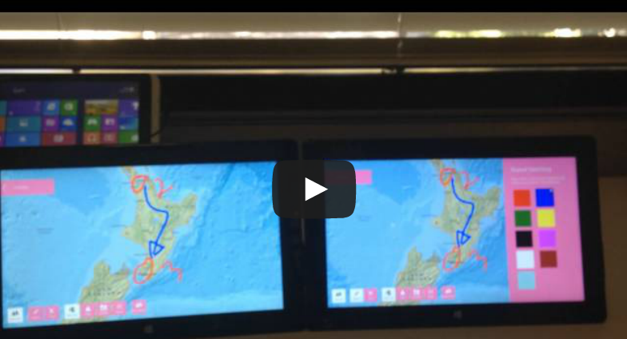

# Esri-Proximity-Map

This app demonstrates peer-to-peer collaboration in a mapping application developed using the [ArcGIS Runtime SDK for .NET](https://developers.arcgis.com/net/).  The app uses Windows 8 native [proximity](http://msdn.microsoft.com/en-us/library/windows/apps/hh465221.aspx) capability to establish an ad hoc [Wi-Fi Direct](https://en.wikipedia.org/wiki/Wi-Fi_Direct) connection that is fast, low latency, secure and doesn’t require any existing network.

For more information, please visit [Proximity Map for Windows Store](http://blogs.esri.com/esri/apl/2013/10/07/proximity-map-for-windows-store/) or associated video [demonstration](https://www.youtube.com/watch?v=Ul06S5wVGkk).

